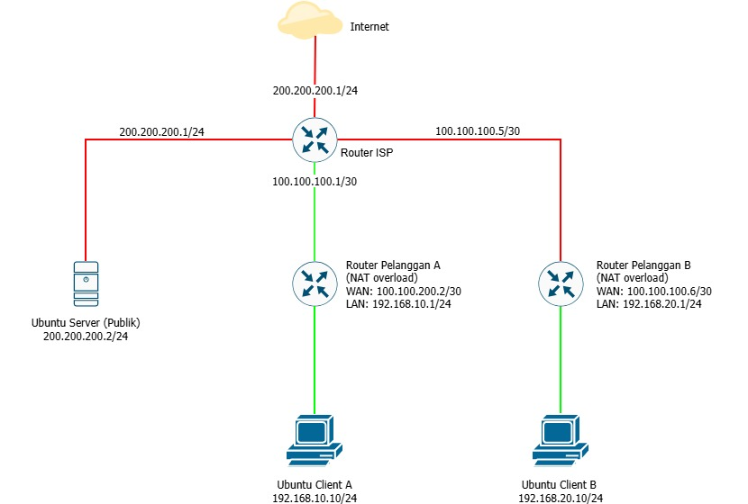

# 🌐 Proyek Jaringan ISP dan Pelanggan

 
 

<h1>
  🌐 Proyek Jaringan ISP dan Pelanggan
</h1>

<em>Rancang Bangun dan Simulasi Jaringan ISP & Pelanggan Menggunakan GNS3</em>

 

 

[🔗 Lihat Topologi Interaktif di Draw.io (Google Drive)](https://drive.google.com/file/d/12KQ1QZL_3OpRYxx2t5PJQMMtXIvLQap8/view?usp=sharing)

 

---

## 📝 Informasi Proyek

- **Kelompok:** 5  
- **Mata Kuliah:** Jaringan Komputer dan Komunikasi Data  
- **Dosen:** Ferdi Chahyadi, S.Kom., M.Cs  

---

## 👥 Anggota Kelompok

| NIM | Nama | PIC |
|-----|------|-------|
| 2401020071 | Auriel Lifta Ekeriana G | Persiapan infrastruktur simulasi GNS3 dan optimasi sumber daya Virtual Machine. |
| 2401020070 | Meyky Ajmariadi | Perancangan topologi fisik jaringan dan konfigurasi routing sentral pada Router ISP. |
| 2401020069 | Balqis Manisa | Implementasi pengalamatan IP, Default Route, dan NAT pada infrastruktur Pelanggan B. |
| 2401020068 | Yura Ramadhani | Implementasi pengalamatan IP, Default Route, dan NAT pada infrastruktur Pelanggan A. |
| 2401020057 | Rauf Hidayat | Integrasi jaringan cloud dan konfigurasi Ubuntu Server Publik. |

---

## 📂 Struktur Folder

- `proposal-analisis/` - Proposal dan analisis kebutuhan
- `diagram/` - Topologi jaringan ([Draw.io Link](https://drive.google.com/file/d/12KQ1QZL_3OpRYxx2t5PJQMMtXIvLQap8/view?usp=sharing))
- `ip-subnetting/` - Tabel IP dan subnetting
- `konfigurasi/` - Screenshot konfigurasi router & server
- `gns3-files/` - File proyek GNS3
- `pengujian/` - Hasil ping, traceroute, routing table
- `video-demo/` - Video demonstrasi (link YouTube)
- `laporan-akhir/` - Laporan akhir & slide presentasi

---

## 📈 Progress Proyek

- [x] **Progres 1 (13 Juni):** Proposal, diagram, tabel IP
- [ ] **Progres 2 (20 Juni):** Implementasi routing dasar
- [ ] **Progres 3 (27 Juni):** NAT & akses internet
- [ ] **Final (1-3 Juli):** Laporan & slide

---

## ⚙️ Cara Menjalankan Simulasi

1. Buka GNS3, import file `gns3-files/topologi_isp.gns3`
2. Start semua perangkat (router ISP, router pelanggan, Ubuntu Server, Ubuntu Client)
3. Konfigurasi IP sesuai tabel di folder `ip-subnetting/`
4. Jalankan konfigurasi routing dan NAT seperti di folder `konfigurasi/`

---

## 🧪 Hasil Pengujian

Lampiran hasil screenshot ping, traceroute, dan routing table setelah pengujian selesai.

---

## 🎥 Video Demonstrasi

*Link YouTube akan diupdate setelah video di-upload.*

